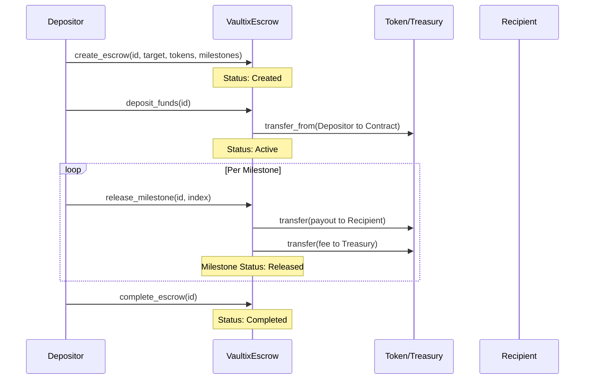
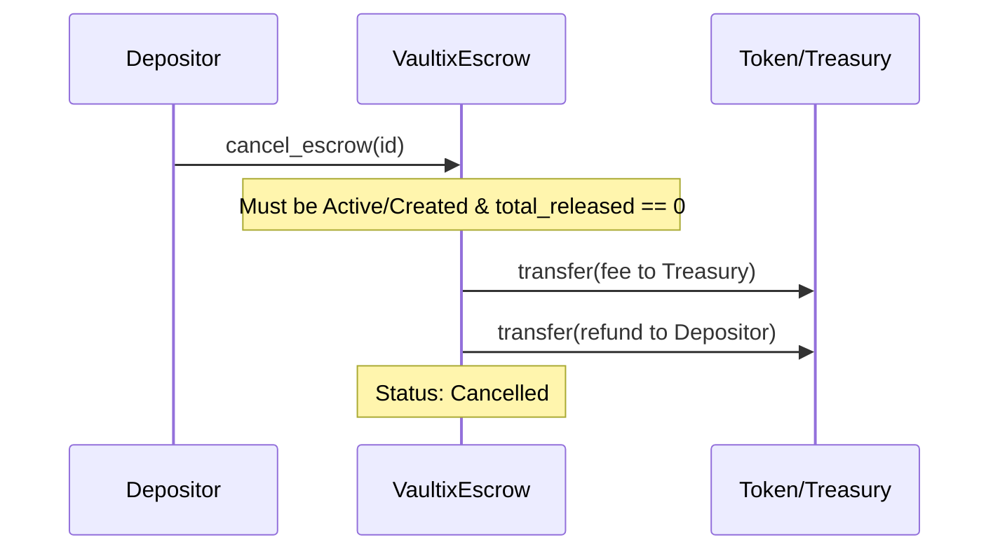
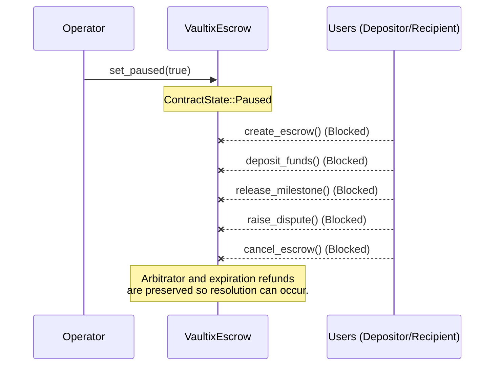
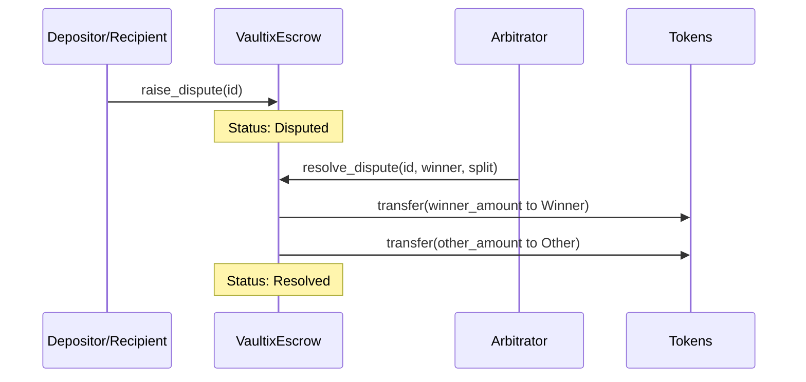

# Contract Workflows

This document visualizes the major workflows of the `VaultixEscrow` contract.

## 1. Happy Path

The intended scenario where both parties fulfill their obligations without disputes.

## 2. Cancellation

An escrow can be canceled prior to any funds being released, resulting in a refund minus any configured fees.

## 3. Emergency Pause (Circuit Breaker)

The Operator can pause the core functions of the contract to halt potential exploits or logic errors.

## 4. Dispute Resolution

If a disagreement arises, either party can raise a dispute, locking the escrow until the Arbitrator steps in.

